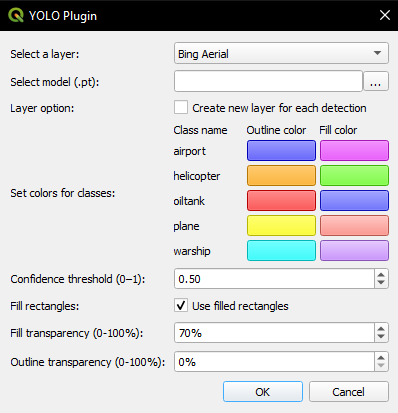
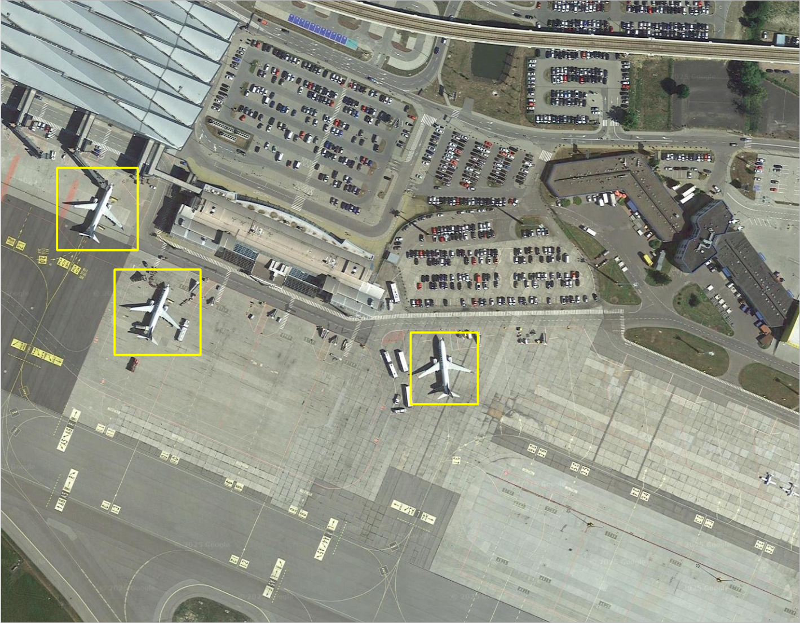
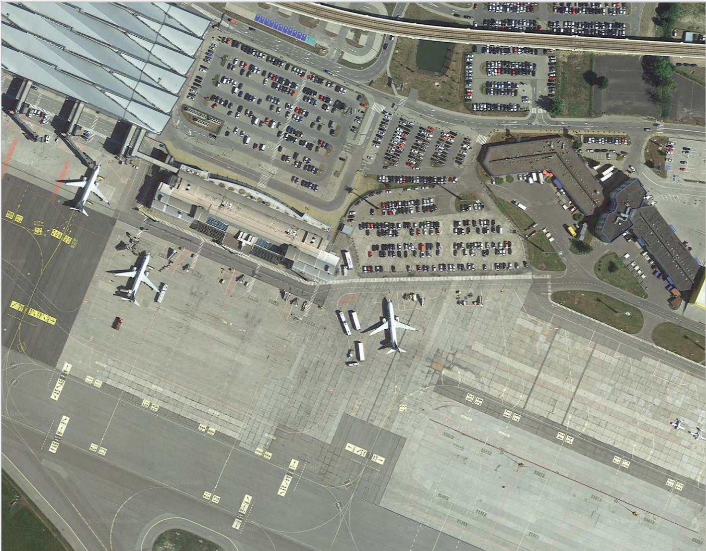
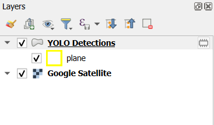

# QGIS YOLO Plugin

## Description
QGIS YOLO Plugin is a QGIS extension designed to integrate **YOLOv8 models** for object detection. The initial version is based on pre-trained models, with plans to develop new models using newer versions of **YOLO**.

## Models Used
Currently, the project includes models from **Madajczak, A. (2023).** *Master Thesis supplementary software (Version 1.0.0)* https://github.com/theATM/AirDetection :
- **L6** – Large YOLOv8 model  
- **Y9** – Small YOLOv8 model  

## Installation & Requirements

### QGIS Environment:
This plugin is built for **QGIS** using the **OSGeo4W** installation environment, which provides a comprehensive set of open-source tools for GIS processing. Ensure you are using **QGIS** installed via OSGeo4W for compatibility.

### Dependencies:
To run the plugin, you need to install the `ultralytics` library, which provides the YOLOv8 model functionality.

### Steps to Install:
1. Open the **OSGeo4W Shell** (found in your QGIS installation directory).
2. Install `ultralytics` by running the following command:
   ```bash
   pip install ultralytics
   ```
3. Copy the yolo_plugin folder from GitHub into the following directory:
    ```bash
    C:\Users\{user_name}\AppData\Roaming\QGIS\QGIS3\profiles\default\python\plugins
    ```
    Replace `{user_name}` with your actual Windows username.

## GUI of QGIS YOLO Plugin
The plugin is configured to let the user define the input parameters:


1. Input layer - image from this layer will be processed.
2. Path to model - selected model will be used for objects recognition.
3. Class colors - user can define colors for each class.
4. Confidence threshold - results with confidence below threshold will not be presented.  
5. Fill rectangles - enable to draw filled rectangles for detected objects.
6. Fill transparency - sets transparency level for filled rectangles.
7. Outline transparency - sets transparency level for rectangle outlines.

## Illustrative examples
This example demonstrates expected output for planes recognition using default parameters and Large YOLOv8 model:







## Known Issues

### Invalid Data Source / Unexpected QGIS Launch

On some systems, running the plugin may trigger errors like:

- `Invalid Data Source: C:\Users\{username}\--json is not a valid or recognized data source.`
- `Invalid Data Source: C:\Users\{username}\AppData\Roaming\Python\Python312\site-packages\cpuinfo\cpuinfo.py is not a valid or recognized data source.`

Additionally, a second QGIS instance might launch unexpectedly. This issue is related to the `cpuinfo` library used internally by `ultralytics`, particularly when calling `get_cpu_info()`.  

#### Temporary Workaround

You can patch the issue by modifying the `ultralytics/engine/predictor.py` file. Locate the `setup_model` function and change the `device` assignment line:

```python
def setup_model(self, model, verbose=True):
    self.model = AutoBackend(
        weights=model or self.args.model,
        device=torch.device("cpu"),  # <---
        dnn=self.args.dnn,
        data=self.args.data,
        fp16=self.args.half,
        batch=self.args.batch,
        fuse=True,
        verbose=verbose,
    )
```

This forces the model to run on CPU, avoiding the call to get_cpu_info() that triggers the issue.

For more context, see the related [Ultralytics GitHub issue #8609](https://github.com/ultralytics/ultralytics/issues/8609).
