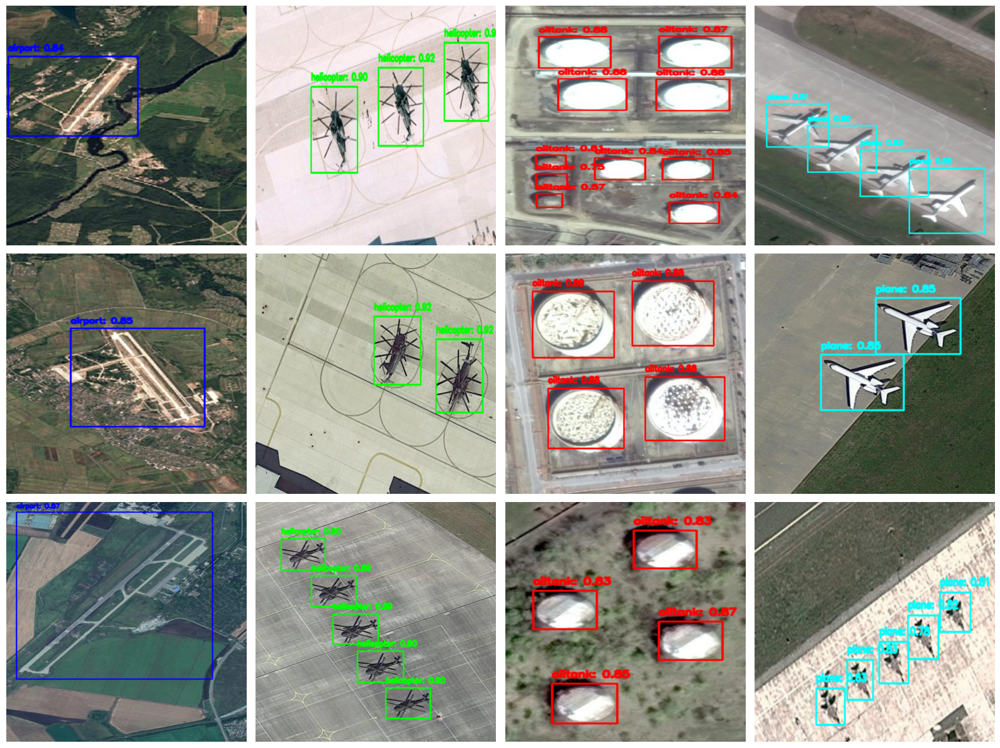
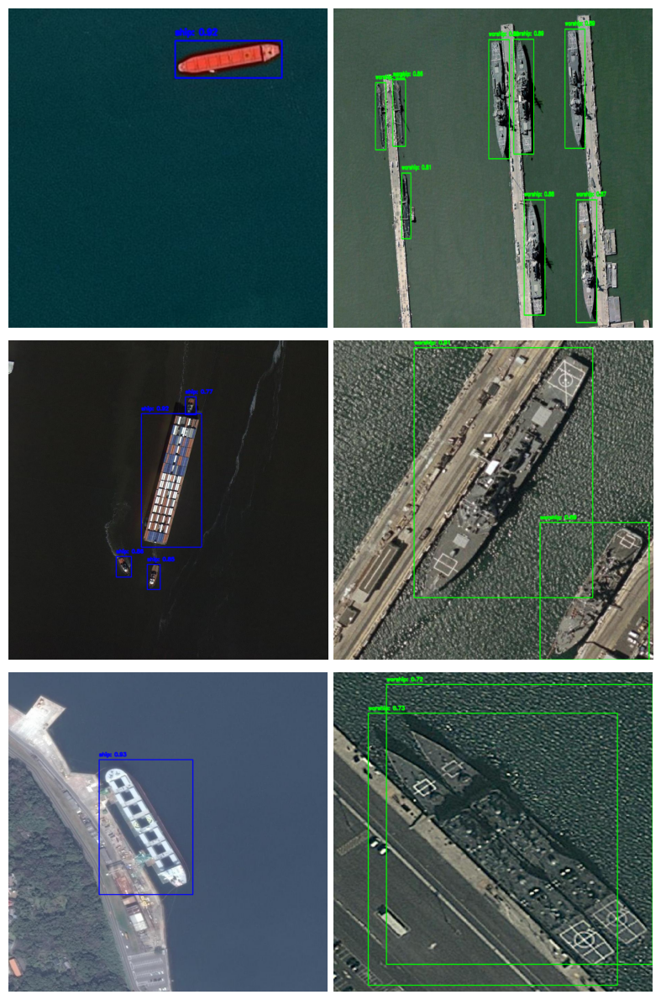
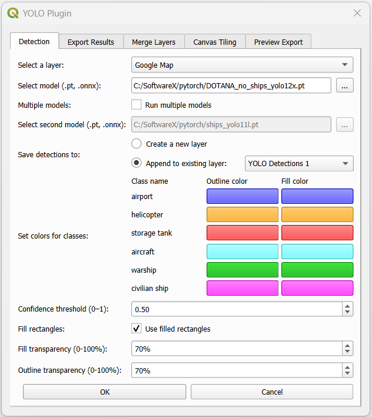
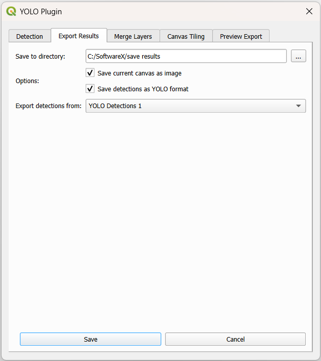
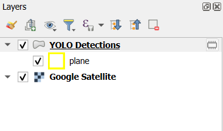

# YOLO-MOD Plugin

## Description

YOLO-MOD is a QGIS plugin for object detection and classification in optical remote sensing imagery using **YOLO deep learning models**. It allows users to detect multiple object categories—such as ships, aircraft, helicopters, airports, and storage tanks—directly within standard GIS workflows. The plugin provides access to pre-trained models and tools for exporting detection results and generating datasets, without requiring prior machine learning experience. The latest version supports **YOLOv11 and YOLOv12** architectures with multiple model sizes.

## Datasets and Models

### Datasets

1. **[DOTANA](https://drive.google.com/file/d/1s0u--CU-VVmv0t_O9_3TNNA2VcLahLPu/)** – Original dataset containing `storage tank`, `airport`, `helicopter`, and `aircraft`.  
   **[Modified DOTANA](https://mega.nz/file/2iA1RLpK#PEtxII1kMVUM60KDd4zwDGs8ghSK3w-g6Zazq_Q-bf4)** – `warships` removed to focus on non-ship objects.

2. **[ShipRSImageNet](https://github.com/zzndream/ShipRSImageNet?tab=readme-ov-file#dataset-download)** – Dataset containing `warships` and `civilian ships`.  
   **[YOLO-formatted ShipRSImageNet](https://mega.nz/file/X7oFDTQI#elcggfqFufNkKySSAAkelz_PAN5UB3AoDr3AIy-irls)** – Converted/modified version for YOLO training.

### Trained Models

Models are trained in **four sizes**: Small, Medium, Large, Extra Large.

* Total of **16 trained models** (4 sizes × 2 datasets × 2 YOLO versions).

The **best-performing models** (based on `mAP50-95`) are available via Google Drive: 
- ONNX format: [link](https://mega.nz/folder/HRNgmIxb#nPljOQT_tkkqncx8HykPDw)
- PyTorch format (.pt): [link](https://mega.nz/folder/euQ1iIza#qc6S5maLXW0JNmW4tkyn8A)
  
**Best model filenames:**
- `DOTANA_no_ships_yolo12x.onnx`, `DOTANA_no_ships_yolo12x.pt`
- `DOTANA_no_ships_yolo11x.onnx`, `DOTANA_no_ships_yolo11x.pt`
- `ships_yolo11l.onnx`, `ships_yolo11l.pt`
- `ships_yolo11s.onnx`, `ships_yolo11s.pt`

| Dataset           | Model Size  | Yolo version | Soft-NMS | mAP50-95 | mAP50  |
| ----------------- | ----------  | ----------   | -------- | -------- | -----  |
| DOTANA (no ships) | Extra Large | 12           | No       | 0.6039   | 0.9591 |
| DOTANA (no ships) | Extra Large | 11           | No       | 0.6030   | 0.9581 |
| ShipRSImageNet    | Large       | 11           | No       | 0.7548   | 0.9025 |
| ShipRSImageNet    | Small       | 11           | No       | 0.7543   | 0.9065 |

###  Old models
The project uses models from **Madajczak, A. (2023).** *Master Thesis supplementary software (Version 1.0.0)* https://github.com/theATM/AirDetection :
- **L6** – Large YOLOv8 model  
- **Y9** – Small YOLOv8 model  

## Visual Examples

**DOTANA (no ships) predictions:**



**ShipRSImageNet predictions:**



These images show grids of sample images from test sets with bounding boxes and labels around detected objects.

## Plugin Installation

1. Download the plugin ZIP: **[yolo_plugin.zip](https://mega.nz/file/myZy2YhI#dzvOriEDzWgH2LGubRsLKQlIlJJsKtbHh_a_DUHvi_4)**

2. Run **QGIS**.

3. Open: **Plugins → Manage and Install Plugins**

4. Select: **Install from ZIP**

5. Choose the downloaded ZIP file.

6. Click **Install Plugin**.

## Requirements

### QGIS Environment
This plugin is developed and tested with **QGIS installed via OSGeo4W (Windows)**.  
Other installations are not supported.

### Python Dependency
The plugin depends on the `ultralytics` Python library.

### Install Dependency (Windows / OSGeo4W)

1. Open **OSGeo4W Shell** matching your QGIS installation.
2. Run:
   ```bash
   pip install ultralytics onnx onnxruntime-gpu
   ```

## YOLO-MOD Plugin GUI
The plugin is configured to let the user define the input parameters:
1. Select a layer - image from this layer will be processed.
2. Select model - selected model will be used for objects recognition.
3. Multiple layers - possibilty to enable two models.
4. Select second model - second model used for object detection.
5. Save detections to - specifies whether detections are saved to a new layer or appended to an existing layer (e.g. “YOLO Detections 1”).
6. Class colors - user can define colors for each class.
7. Confidence threshold - results with confidence below threshold will not be presented.  
8. Fill rectangles - enable to draw filled rectangles for detected objects.
9. Fill transparency - sets transparency level for filled rectangles.
10. Outline transparency - sets transparency level for rectangle outlines.


The YOLO-MOD plugin provides an export interface for layer data, including:
- map extent export to PNG,
- detection export in YOLO format,
- output directory selection,
- source layer selection.


## Illustrative examples
This example demonstrates expected output for planes recognition using default parameters and Large YOLOv8 model:




## Known Issues

### Invalid Data Source / Unexpected QGIS Launch

On some systems, running the plugin may trigger errors like:

- `Invalid Data Source: C:\Users\{username}\--json is not a valid or recognized data source.`
- `Invalid Data Source: C:\Users\{username}\AppData\Roaming\Python\Python312\site-packages\cpuinfo\cpuinfo.py is not a valid or recognized data source.`

Additionally, a second QGIS instance might launch unexpectedly. This issue is related to the `cpuinfo` library used internally by `ultralytics`, particularly when calling `get_cpu_info()`.  

#### Temporary Workaround

You can patch the issue by modifying the `ultralytics/engine/predictor.py` file. Locate the `setup_model` function and change the `device` assignment line:

```python
def setup_model(self, model, verbose=True):
    self.model = AutoBackend(
        weights=model or self.args.model,
        device=torch.device("cpu"),  # <---
        dnn=self.args.dnn,
        data=self.args.data,
        fp16=self.args.half,
        batch=self.args.batch,
        fuse=True,
        verbose=verbose,
    )
```

This forces the model to run on CPU, avoiding the call to get_cpu_info() that triggers the issue.

For more context, see the related [Ultralytics GitHub issue #8609](https://github.com/ultralytics/ultralytics/issues/8609).
