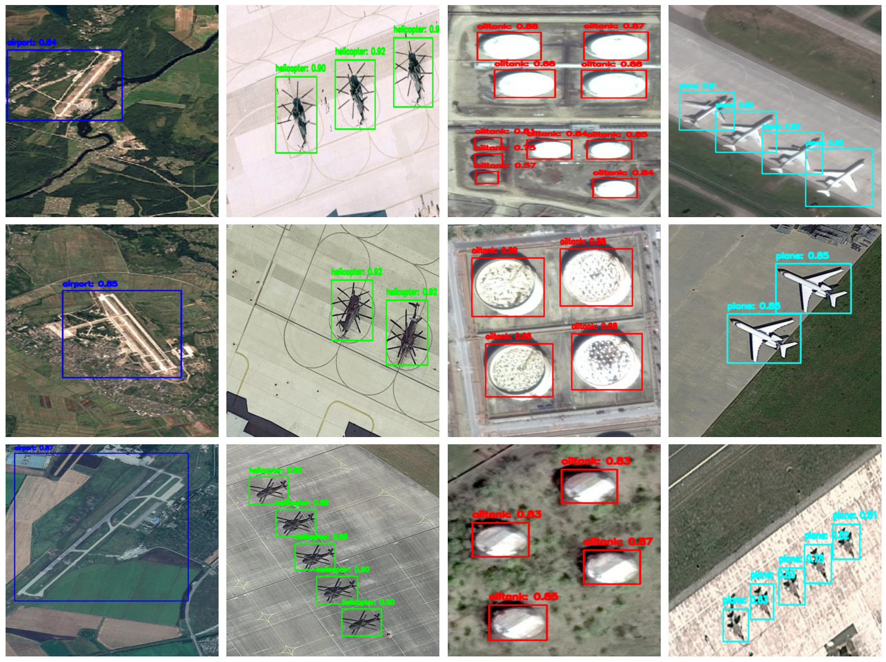
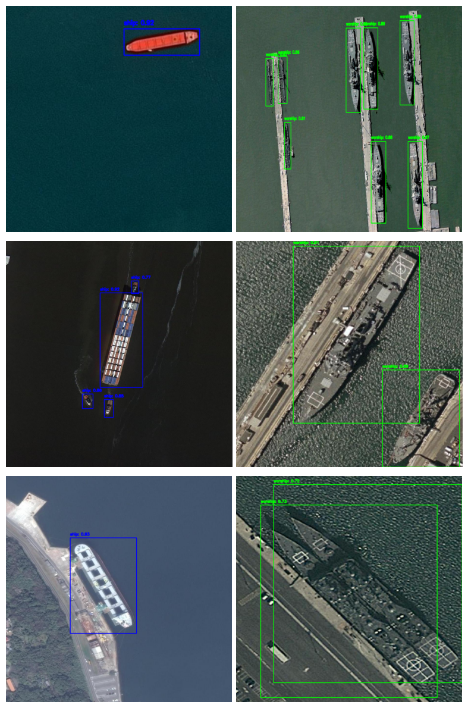
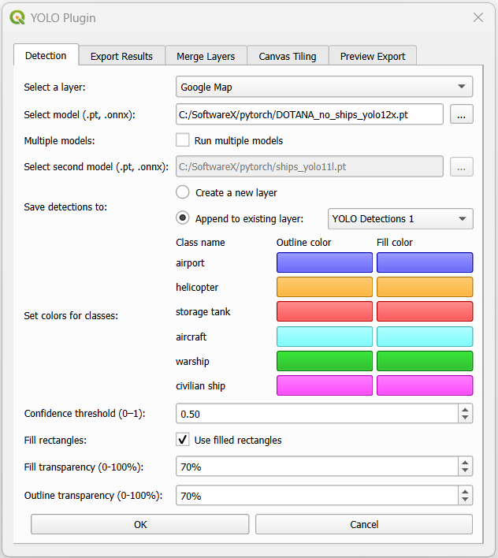
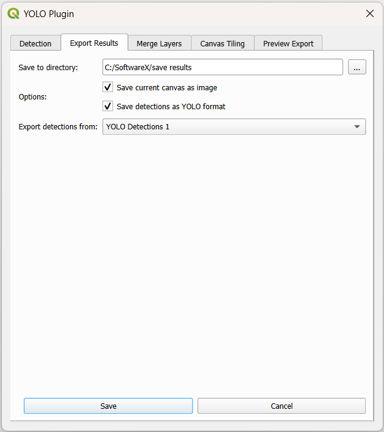
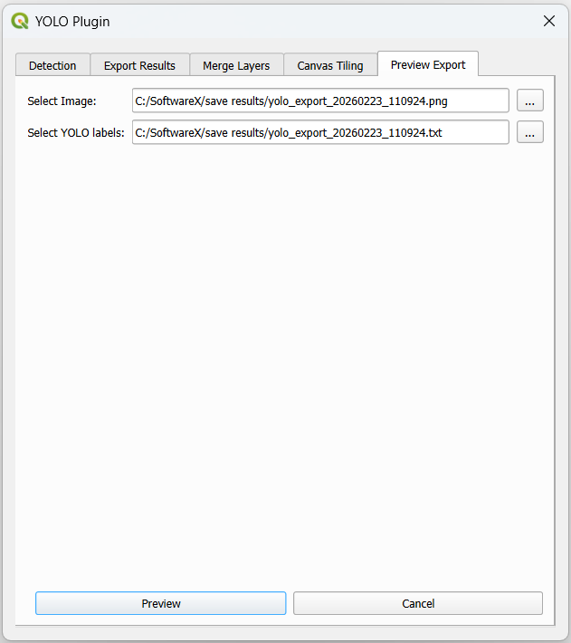
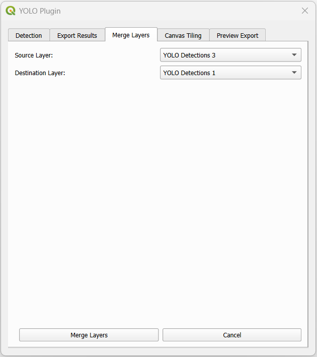
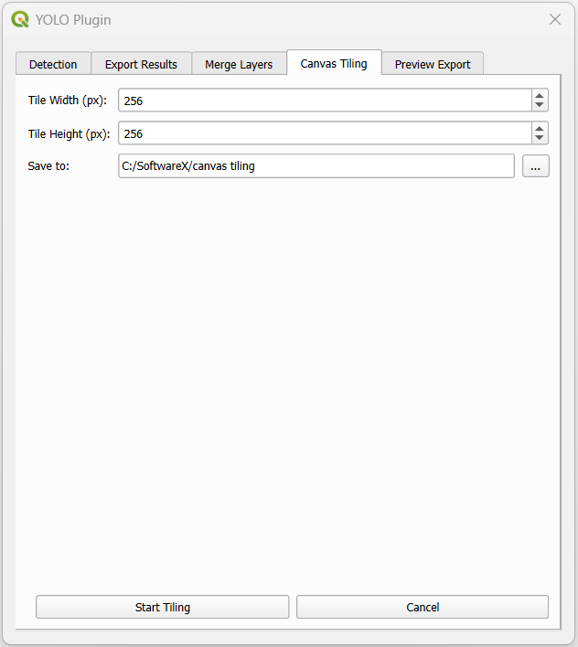
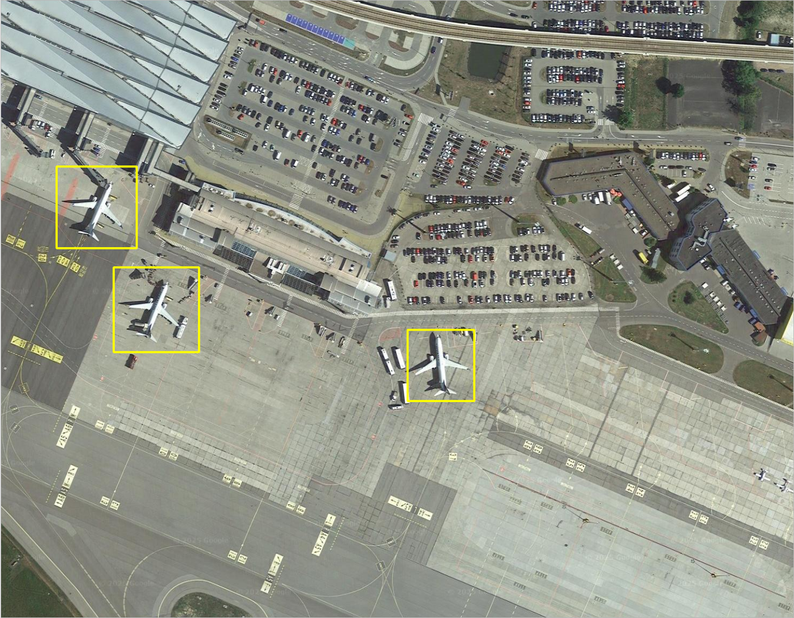
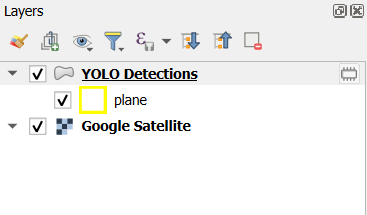

# YOLO-MOD Plugin

⚠️ Trained models are not included in this repository and must be downloaded from Zenodo (see the section below).

## Current release

Version: **v2.0.0**

Latest plugin package:  
yolo_mod.zip

Tested environment:

- QGIS 3.40 (Bratislava)
- QGIS 3.42 (Münster)
- Windows 11
- OSGeo4W distribution
  
Future releases and updates will be published through the GitHub repository.

## Description

YOLO-MOD is a QGIS plugin for object detection and classification in optical remote sensing imagery using **YOLO deep learning models**. It allows users to detect multiple object categories—such as ships, aircraft, helicopters, airports, and storage tanks—directly within standard GIS workflows. The plugin provides access to pre-trained models and tools for exporting detection results and generating datasets, without requiring prior machine learning experience. The latest version supports **YOLOv11 and YOLOv12** architectures with multiple model sizes.

## Datasets and Models

The YOLO-MOD plugin does not include trained models in the plugin package in order to keep it lightweight.

### Model Download

All trained models used in this project are publicly available via the Zenodo platform:

👉 https://zenodo.org/records/19534383  

👉 https://doi.org/10.5281/zenodo.19534383  

The repository provides:

- PyTorch (`.pt`) models  
- ONNX (`.onnx`) models  
- metadata files describing model architecture, training dataset, input resolution, and performance metrics  

This ensures long-term accessibility and reproducibility of the results presented in the associated *SoftwareX* publication.

### How to use models

1. Download the archive from Zenodo  
2. Extract `yolo-mod-models.zip`  
3. Select the desired model (`.pt` or `.onnx`)  
4. Load it in the YOLO-MOD plugin  

### Notes

- Trained models are **not stored in this repository**  
- Zenodo is the **primary distribution platform**  
- Previously used file hosting services (e.g., MEGA) may still be available as mirrors, but are not recommended for citation or long-term access  

---

### Datasets

1. **[DOTANA](https://drive.google.com/file/d/1s0u--CU-VVmv0t_O9_3TNNA2VcLahLPu/)** – Original dataset containing `storage tank`, `airport`, `helicopter`, and `aircraft`.  

2. **[ShipRSImageNet](https://github.com/zzndream/ShipRSImageNet?tab=readme-ov-file#dataset-download)** – Dataset containing `warships` and `civilian ships`.  

---

### Model Summary

| Dataset           | Model Size  | YOLO version | mAP50-95 | mAP50  |
| ----------------- | ----------  | ------------ | -------- | ------ |
| DOTANA (no ships) | Extra Large | 12           | 0.6039   | 0.9591 |
| DOTANA (no ships) | Extra Large | 11           | 0.6030   | 0.9581 |
| ShipRSImageNet    | Large       | 11           | 0.7548   | 0.9025 |
| ShipRSImageNet    | Small       | 11           | 0.7543   | 0.9065 |

### Old models
The project uses models from **Madajczak, A. (2023).** *Master Thesis supplementary software (Version 1.0.0)* https://github.com/theATM/AirDetection :
- **L6** – Large YOLOv8 model  
- **Y9** – Small YOLOv8 model  

## Visual Examples

**DOTANA (no ships) predictions:**



**ShipRSImageNet predictions:**



These images show grids of sample images from test sets with bounding boxes and labels around detected objects.

## Cross-dataset Benchmarking (FAIR1M)

To assess the generalization capability of the proposed models beyond the training domain, additional experiments were conducted using a subset of the FAIR1M dataset [1], which was not used during model training or prior evaluation.

### Experimental setup

- Dataset: FAIR1M (selected maritime scenes)
- Number of images: 70
- Image resolution: 2000–7000 pixels (variable)
- Scene types: port areas, coastal infrastructure, and ship-dense regions
- Annotation format: oriented bounding boxes (OBB) converted to horizontal bounding boxes (HBB)
- Training dataset: ShipRSImageNet
- Models:
  - YOLOv11 Large (`ships_yolo11l`)
  - YOLOv8 Large
  - The YOLOv8 Large model used in this study serves as a baseline and was trained using the publicly available Ultralytics implementation on the ShipRSImageNet dataset. To ensure a fair comparison, identical training conditions were applied. The trained YOLOv8 model is not distributed in this repository but can be reproduced following the described experimental setup.
This approach is consistent with standard practice, where baseline models are described but not necessarily redistributed.
- Training duration: 100 epochs (identical for both models to ensure fair comparison)
- Soft-NMS: not used

The selected subset was designed to reflect challenging real-world conditions, including high object density, arbitrary object orientations, and complex backgrounds.

---

### Results

| Model          | mAP50  | mAP50-95 |
|----------------|--------|----------|
| YOLOv11 Large  | 0.0956 | 0.0531   |
| YOLOv8 Large   | 0.0797 | 0.0471   |

---

### Reference (in-domain performance)

For comparison, evaluation on the ShipRSImageNet test set yielded:

| Model          | mAP50  | mAP50-95 |
|----------------|--------|----------|
| YOLOv11 Large  | 0.9025 | 0.7548   |

---

### Key observations

- A substantial performance drop is observed when transferring models to unseen data (FAIR1M), with mAP50 values below 0.10.
- This contrasts sharply with in-domain performance (mAP50 ≈ 0.90), indicating a significant generalization gap.
- YOLOv11 Large slightly outperforms YOLOv8 Large; however, both models exhibit limited robustness in real-world conditions.
- The performance degradation is not caused by insufficient training, as both models were trained for 100 epochs under identical conditions.

---

### Discussion

The observed performance gap highlights the limitations of models trained on curated datasets when applied to complex, high-resolution remote sensing imagery. Key contributing factors include:

- Differences in spatial resolution between training and evaluation data
- Increased scene complexity and object density
- Arbitrary object orientations
- Domain shift between datasets

These findings are consistent with the qualitative evaluation presented in the paper (Section 3.1), where similar failure modes (missed detections, classification errors, and false positives) are observed in large-swath imagery.

---

### Reproducibility

All models, configuration files, and example inference scripts are available in this repository.

The FAIR1M dataset is publicly available from its original source [1]. Due to licensing restrictions, the modified subset used in this study is not redistributed. However, the experimental setup can be reproduced by selecting maritime scenes (e.g., port areas and ship-dense regions) and converting the provided oriented bounding box (OBB) annotations to horizontal bounding boxes (HBB).

---

### Reference

[1] Sun, X., Wang, P., Yan, Z., Xu, F., Wang, R., Diao, W., ... & Fu, K. (2022). FAIR1M: A benchmark dataset for fine-grained object recognition in high-resolution remote sensing imagery. *ISPRS Journal of Photogrammetry and Remote Sensing*, 184, 116–130.

## Installation Overview

The YOLO-MOD plugin is currently distributed as a ZIP package and can be installed in QGIS using the Install from ZIP option.

## ⚙️ Python Dependencies

⚠️ These dependencies are not installed automatically by QGIS.

In addition to the plugin installation, several Python dependencies must also be installed in the QGIS Python environment:

- ultralytics
- onnx
- onnxruntime / onnxruntime-gpu

Detailed installation instructions and tested dependency versions are provided below. Future versions of the plugin are planned to be distributed through the official QGIS Plugin Repository.

## Plugin Installation

1. Download the plugin ZIP: **[yolo_mod.zip](https://mega.nz/file/yQFT0QYA#HrRuEY-1COQu8B7XO7vM0LpPJJ2j7NvHBBbNesMSawo)**

2. Run **QGIS**.

3. Open: **Plugins → Manage and Install Plugins**

4. Select: **Install from ZIP**

5. Choose the downloaded ZIP file.

6. Click **Install Plugin**.

## Requirements

### QGIS Environment
The plugin was developed and tested on Windows 11 using QGIS installed via **OSGeo4W (versions 3.40.6-Bratislava and 3.42.2-Münster)**. Other installation methods and operating systems are not supported.

## Hardware Requirements

GPU acceleration is strongly recommended for practical use.

- **Recommended:** NVIDIA GPU with CUDA support (CUDA 11.x or 12.x, depending on PyTorch/ONNX Runtime build)
- **CPU-only mode:** supported, but significantly slower and not suitable for large images or real-world workflows

The plugin supports both PyTorch and ONNX Runtime inference backends:
- PyTorch requires CUDA-enabled installation for GPU acceleration
- ONNX Runtime can run in CPU or GPU mode depending on the installed package (onnxruntime / onnxruntime-gpu)

### Python Dependency
The plugin depends on the `ultralytics` Python library.

### Install Dependency (Windows / OSGeo4W)

1. Open **OSGeo4W Shell** matching your QGIS installation.
2. Run:
   ```bash
      # CPU version
      pip install ultralytics onnx onnxruntime

      # GPU version (recommended)
      pip install ultralytics onnx onnxruntime-gpu
   ```

### Recommended dependency versions (tested)

Due to potential compatibility issues with the QGIS embedded Python environment (OSGeo4W), it is recommended to install the following tested versions of the dependencies:

```bash
pip install ultralytics==8.3.0
pip install onnx==1.16.1
pip install onnxruntime-gpu==1.18.0
pip install numpy==1.26.4  # optional; ensure compatibility with QGIS Python environment
 ```
These versions were tested with QGIS 3.40.6 (Bratislava) and 3.42.2 (Münster) using the OSGeo4W distribution (Python 3.11).

## YOLO-MOD Plugin GUI
The plugin is configured to let the user define the input parameters:
1. Select a layer - image from this layer will be processed.
2. Select model - selected model will be used for objects recognition.
3. Multiple layers - possibilty to enable two models.
4. Select second model - second model used for object detection.
5. Save detections to - specifies whether detections are saved to a new layer or appended to an existing layer (e.g. “YOLO Detections 1”).
6. Class colors - user can define colors for each class.
7. Confidence threshold - results with confidence below threshold will not be presented.  
8. Fill rectangles - enable to draw filled rectangles for detected objects.
9. Fill transparency - sets transparency level for filled rectangles.
10. Outline transparency - sets transparency level for rectangle outlines.


The YOLO-MOD plugin provides an export interface for layer data, including:
- map extent export to PNG,
- detection export in YOLO format,
- output directory selection,
- source layer selection.


The YOLO-MOD plugin interface enables:
- Preview saved detections using a raster image (.png) and the corresponding YOLO annotation file (.txt).


Merge detection results from multiple layers by selecting a source and target layer. The merged output is saved to the target layer.



Automatically split the current QGIS map extent into image tiles based on user-defined width, height, and output directory.



## Illustrative examples
This example demonstrates expected output for planes recognition using default parameters and Large YOLOv8 model:





## Known Issues

### Invalid Data Source / Unexpected QGIS Launch

On some systems, running the plugin may trigger errors like:

- `Invalid Data Source: C:\Users\{username}\--json is not a valid or recognized data source.`
- `Invalid Data Source: C:\Users\{username}\AppData\Roaming\Python\Python312\site-packages\cpuinfo\cpuinfo.py is not a valid or recognized data source.`

Additionally, a second QGIS instance might launch unexpectedly. This issue is related to the `cpuinfo` library used internally by `ultralytics`, particularly when calling `get_cpu_info()`.  

#### Temporary Workaround

You can patch the issue by modifying the `ultralytics/engine/predictor.py` file. Locate the `setup_model` function and change the `device` assignment line:

```python
def setup_model(self, model, verbose=True):
    self.model = AutoBackend(
        weights=model or self.args.model,
        device=torch.device("cpu"),  # <---
        dnn=self.args.dnn,
        data=self.args.data,
        fp16=self.args.half,
        batch=self.args.batch,
        fuse=True,
        verbose=verbose,
    )
```

This forces the model to run on CPU, avoiding the call to get_cpu_info() that triggers the issue.

For more context, see the related [Ultralytics GitHub issue #8609](https://github.com/ultralytics/ultralytics/issues/8609).

### Slower first inference when using ONNX models

The first ONNX inference usually has a higher initialization cost due to session setup.  
Subsequent inferences are significantly faster, as the model and required resources are already loaded in memory.  
In PyTorch (.pt), this initial overhead is often smaller.

## Citation

If you use YOLO-MOD in your research, please cite the corresponding SoftwareX article.
